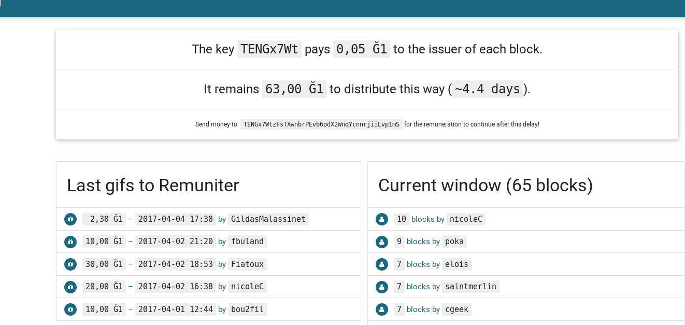

Title: Rémunération des calculateurs
Order: 2
Date: 2017-04-10
Slug: theorie
Authors: inso

Dans Duniter, à la différence des cryptomonnaies usuelles, le réseau n'intègre pas de *taxe* sur les transactions.
La raison est qu'il faut éviter de mélanger les sujets. Afin de rester simple, la base technique (la blockchain, 
le réseau P2P) ne devrait pas intégrer les moyens de rémunérer ceux qui hébergent les noeuds.

>Attention, seuls les noeuds associés à un compte membre peuvent calculer les blocs.

## Pourquoi devrais-je faire tourner un nœud ?

Pour la même raison que vous partagez des fichiers torrents sans attendre de rémunération en retour ! Simplement
pour faire vivre le réseau. Il y a plusieurs facteurs à prendre en compte :

**Le calcul de bloc dans Duniter ne coûte presque rien.** Ce qui sécurise la blockchain est le fait que chaque calculateur
est explicitement associé à un être humain. Ainsi, pas de risque d'attaque Sybil, et il n'y a aucune course à la
puissance nécessaire !

> Tant que votre PC est dans la moyenne des puissances existantes (environ du Raspberry Pi au PC 4 cœurs), votre nœud pourra participer au calcul des blocs.

**Vous ne devriez pas attendre que d'autres membres calculent pour vous.** Exécuter votre nœud, c'est vous qui assurer que le 
réseau respecte les règles communes inscrites dans la blockchain. Ce nœud s'assurera pour vous que les Dividendes
Universels sont correctements générés, et que les transactions sont transmises.

## Quand même, il n'y a vraiment aucune rémunération envisagée pour partager son nœud avec le réseau ?

Aujourd'hui, le calcul des blocs peut être rémunéré par le service [Remuniter](https://remuniter.cgeek.fr/#/). Le fonctionnement est simple : les utilisateurs peuvent transférer de la monnaie sur la clé de Remuniter, et le service va se charger de distribuer la monnaie reçue aux calculateurs.
 

À terme, l'économie Duniter se développera par elle-même et inventera ses solutions par-dessus le calcul des blocs. Par exemple, on peut envisager une société qui accepterait de ne calculer des blocs contenant des transactions d'utilisateurs que s'ils ont envoyé de la monnaie à cette société. Elle calculerait alors des blocs contenant la transaction de l'utilisateur ainsi que le paiement requis pour la transaction.

Il faut noter que cet élément **économique** se serait alors bien effectué **par-dessus le protocole technique**. Celui-ci est neutre, et n'induit par défaut aucun comportement particulier vis-à-vis de l'activité de calcul des blocs.
